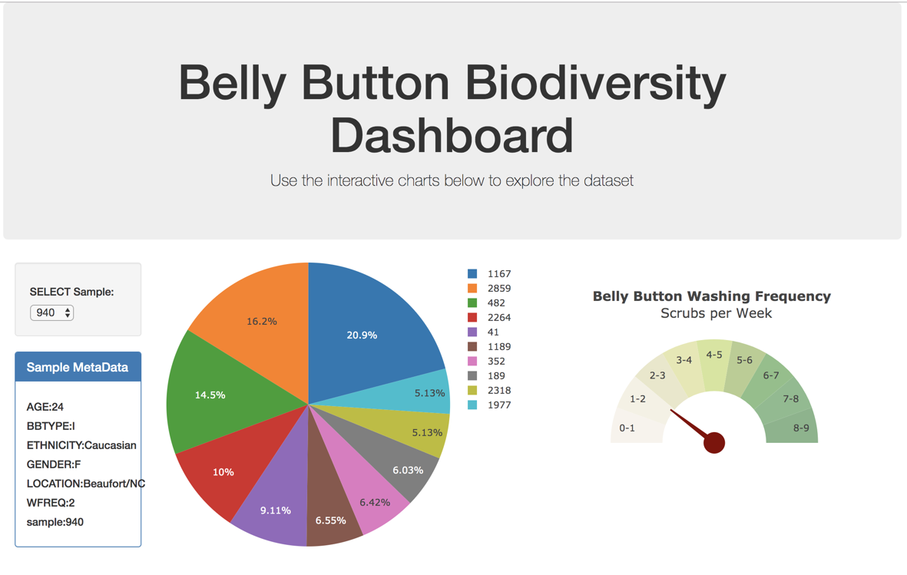
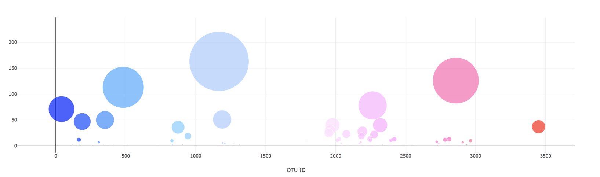

# Belly Button Biodiversity Dashboard

### Website Link: [https://belly-button-diversityapp.herokuapp.com/](https://belly-button-diversityapp.herokuapp.com/)

## Purpose

Build an interactive dashboard to explore the [Belly Button Biodiversity DataSet](http://robdunnlab.com/projects/belly-button-biodiversity/).

Used Plotly.js to build interactive charts for the Belly Button Diversity dashboard.

## Tools Used:

Front End: JavaScript, HTML5, Bootstrap, Plotly.js, D3.js

Back End: Python, Flask, SQLAlchemy, SQLite, JSON

## Flask API

1. PIE chart uses data from your samples route (`/samples/<sample>`) to display the top 10 samples.
2. Bubble Chart that uses data from your samples route (`/samples/<sample>`) to display each sample.
3. Display the sample metadata from the route `/metadata/<sample>`

## Heroku Deployment

This Flask app is deployed on Heroku.  <https://belly-button-diversityapp.herokuapp.com/>

## Screenshots

